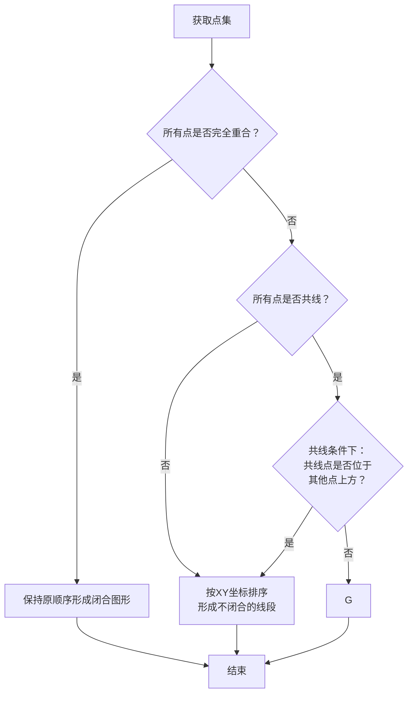

在歌姬计划Arcade中，Sega引入了多押Note的概念，玩家需要按下多个对应的按键触发判定得分。也许是考虑到辅助玩家读谱，Sega在游戏中将多押Note图像变得更亮并且用连接线连了起来  
而这也将成为后续尝试复现原作逻辑的同人游戏开发者的噩梦……

## 只是将点连起来成为一个多边形有这么难吗？ 
也许你会觉得，我们只需要把多个点**按顺序连接起来就可以了**  
那么让我们跟着这个思路尝试编写代码，首先我们创建一个向量类便于后续进行计算  
```python
from dataclasses import dataclass
@dataclass(frozen=True)
class Vector:
    x:float
    y:float

    def __add__(self, other) -> "Vector":
        # a + b
        if isinstance(other, Vector):
            return Vector(self.x + other.x, self.y + other.y)
        elif isinstance(other, (int, float)):
            return Vector(self.x + other, self.y + other)
        else:
            raise TypeError()

    def __sub__(self, other) -> "Vector":
        # a - b
        if isinstance(other, Vector):
            return Vector(self.x - other.x, self.y - other.y)
        elif isinstance(other, (int, float)):
            return Vector(self.x - other, self.y - other)
        else:
            raise TypeError()

    def __truediv__(self, other) -> "Vector":
        # a / b
        if isinstance(other, (int, float)):
            return Vector(self.x / other, self.y / other)
        else:
            raise TypeError()

```
对于两个Note，我们只需要将其直接连接起来就行
```python
if len(multi_note) == 2:
    draw_connect_line(multi_note[0], multi_note[1])
```
三个Note也不复杂，只需要按顺序进行连接就可以确保每个点都能两两相连形成三角形  
```python
if len(multi_note) == 3:
    draw_connect_line(multi_note[0], multi_note[1])
    draw_connect_line(multi_note[1], multi_note[2])
    draw_connect_line(multi_note[2], multi_note[0])
```
正当你兴致勃勃的尝试实现四个Note的连线时，问题开始出现了：  
1. 四个点无法形成一个确定的多边形
2. 我们无法确定程序读取到的数据顺序一定是正确的
3. 随意的连接四个Note有极高的概率出现自交

因此我们需要对Note进行排序

## 那么正确的多押线应该如何实现呢？    
目前，我们**并不能确定Diva究竟使用了什么办法实现这个功能**，各个同人游戏给出的多押实现在特定情况下均会与官作产生差异，但我们仍然可以用其他算法方式去实现  

----

### ComfyStudio：极角排序法   
一种做法是先找出这些点的中点，**以中点为圆心转圈**向四周扫描，按扫描到的顺序对点进行排序后连接。  
这个方法也被应用于其他同人游戏项目中，效果很不错。  
代码思路如下:
1. 计算各个点的中点
2. 计算各个点到中点的夹角
3. 按夹角重新排序，如果夹角一致则使用模长
4. 按顺序绘制多押线并将结尾连起来


```python
def polar_angle_sort(multi_note: list[Vector]) -> list[Vector]:
    count = len(multi_note)
    centorid = Vector(0,0)

    for note in multi_note:
        centorid = centorid + note
    centorid = centorid / count

    def sorted_func(note) -> tuple[float, float]:
        angle = math.atan2(note.y - centorid.y, note.x - centorid.x)
        distance = (note.x - centorid.x)**2 + (note.y - centorid.y)**2 # 模长不开方避免精度损失
        if angle < 0:
            angle += 2 * math.pi

        return (angle,distance)

    multi_note.sort(key=sorted_func) 

    return multi_note
```

----

### ProjectDxxx：Andrew 凸包算法
在了解这个算法前我们需要先知道一点数学知识： 
- 模长：
    - 数学定义：$$\vec{a} = \sqrt{x^2 + y^2}$$
- 点乘（内积）：
    - 数学定义：$$\vec{a} \cdot \vec{b} = x_1 x_2 + y_1 y_2$$
    - 几何定义：$$\vec{a} \cdot \vec{b} = |\vec{a}|\times|\vec{b}| \cos\theta$$
- 叉乘（外积）：
    - 数学定义：$$\vec{a} \times \vec{b} = x_1 y_2 - y_1 x_2$$
    - 几何定义：$$\vec{a} \times \vec{b} = |\vec{a}|\times|\vec{b}| \sin\theta$$
- sin取值：
    - $$0^\circ \sim 180^\circ: [0, 1]$$
    - $$-180^\circ \sim 0^\circ: [-1, 0]$$
- cos取值：
    - $$0^\circ = 1$$
    - $$180^\circ = -1$$

这个算法的思路如下：
1. 将所有的点按x进行排序，如果x相同则按y进行排序。这时候第一个点和最后一个点一定是凸多边形最边缘的两个顶点
2. 以第一个点为基点，从左往右扫描获得下凸包部分。  
   要让下半部分维持凸起状态则所有的点下一步都需要往左转，根据这个规则保留准备左转的点
3. 以最后一个点为基准，从右往左扫描获得上凸包部分。按上面的规则保留所有准备往右转的点
4. 合并两个凸包
5. 处理遗漏点（后面会提）

那么我们要如何确定一个点往哪个方向旋转呢？  
我们看叉乘的几何定义会发现其使用到了<mark>sin函数</mark>，其在一二象限中取值大于0，三四象限中取值小于0，因此可以直接利用叉乘判断点在哪一侧  
当点在同一条线上时，我们可以利用点乘几何定义中的cos函数判断点在哪一个位置，正数说明顺序为ABC，负数说明顺序为ACB  


然而凸包算法设计之初是为了在一堆点钟寻找能够包起来的多边形，而如果为一个凹多边形，凸包算法将会舍弃掉凹下去的点形成一个三角形。  
因此KHC选择了一种更简单粗暴的办法：如果存在被舍弃的点，那么这个点将会**直接与其他点相连。**  
这样的做法很简单暴力，但考虑到四个点构成的多边形大概率是凸多边形，这种少数情况不进行严格处理也在情理之中  

----

### 我个人推测的算法  
> [!NOTE]
> 当前的算法少数情况仍然与Diva官作不符，如果有其他想法欢迎讨论  

我在进行实验观察谱面时发现：并不是所有排序都能组成闭合图形  
因此我们大胆猜测——Diva可能有个判断是否能形成多边形的逻辑，如果其不能形成多边形则退化成线段  

用文字解释比较麻烦，所以我绘制了一个流程图：  

如果看不懂流程也没事，接下来我们会编写代码来实现这个流程  

#### 判断点集形状
首先我们要进行点集形状的判断，在目前我所观测到的结果中，Diva的点集形状判断情况主要分为三种：  
- 所有点在一个位置：不进行排序的闭合多边形
- 所有点共线：不闭合的线段
- 其他情况：闭合多边形

为了提高代码可读性，我们先定义一个enum类表示这三种情况
```python
class Shape(Enum):
    POLYGON = 0
    LINE = 1
    POINT = -1
```
接下来是一般情况下的多边形判断。要想构成一个多边形，其必定会有线段相交，即一定会有点不在同一条直线上  
而叉乘的几何意义会用到sin函数，sin函数在$$0^\circ$$和$$180\circ$$的时候值为0，我们可以利用这一点判断三个点是否在同一直线上，没有则返回多边形类型  
```python
note_pre2: None|Vector = multi_note[0]
note_pre1: None|Vector = multi_note[1]

for i in range(2, len(multi_note)):
    note_cur = multi_note[i]
    if is_polygon == False:
        vet1 = note_pre1 - note_pre2
        vet2 = note_cur - note_pre2
        is_polygon = (vet1.cross(vet2) != 0)
    else:
        return Shape.POLYGON
```
接下来是Diva的特殊多边形判定规则。根据观察，在点集共线的情况下，如果数量最多的共点不处于其他点下方，Diva将会认为他是一个多边形  
在python中，如果要统计一个列表里各个元素出现的次数，Python提供了一个Counter类，该类会将元素存储为键，出现的次数作为值返回一个字典。我们可以直接利用这个类判断有多少个不同位置的点，进而同时达成了坐标去重与数量统计的作用   
但由于Counter类返回的是字典，键值必须支持哈希，因此我们还需要改进向量类，使其支持哈希成为键值  
```python
class Vector: 
    def __hash__(self) -> int:
        return hash((self.x, self.y))
```
判断全共点和孤立点相关逻辑
```python
same_count_dict = Counter(multi_note) # Python自带的统计方法，会把重复的点数统计起来
is_same = False # 判断是否为点
diva_check = False # 修补Diva的判断逻辑

if len(same_count_dict) == 1: # 所有点都在一个位置
    is_same = True

if len(same_count_dict) == 2: # 存在两个不重复的位置
    diva_check = True
    single:None|Vector = None
    multi:None|Vector = None

    keys:list[Vector] = list(same_count_dict.keys())
    
    if same_count_dict[keys[0]] > same_count_dict[keys[1]] and same_count_dict[keys[1]] == 1:
        single, multi = keys[1], keys[0]
        
    elif same_count_dict[keys[0]] < same_count_dict[keys[1]] and same_count_dict[keys[0]] == 1:
        single, multi = keys[0], keys[1]

    if isinstance(single, Vector) and isinstance(multi, Vector):
        diva_check = (multi.y - single.y) <= 0
```
>[!NOTE]
> 事实上，由于Diva本身并不支持四个点以上的多押，目前并不能证明在共线时其判定是否为多边形到底是根据最上方的点是独立点还是根据共点。请根据自己的最终目标决定如何处理  

下面是完整的判断形状函数代码
```python
def get_shape_type(multi_note: list[Vector]) -> Shape:
    if len(multi_note) == 0:
        raise ValueError("multi_note list is empty")
    
    if len(multi_note) == 1:
        return Shape.POINT
    
    if len(multi_note) == 2:
        return Shape.LINE

    def diva_polygon_check(same_count_dict:dict[Vector, int]) -> bool:
        # 只有在所有点共线的时候才会调用函数
        top_note:Vector    = max(same_count_dict.keys(), key= lambda p: p.y)
        bottom_note:Vector = min(same_count_dict.keys(), key= lambda p: p.y)

        # 判断是否是垂直线
        if top_note.x == bottom_note.x:
            return False
        # 判断是否是水平线
        if top_note.y == bottom_note.y:
            return False
        # 处理Diva的情况
        if same_count_dict[top_note] > same_count_dict[bottom_note]:
            return False

        return True

    is_dot: bool = False
    is_polygon: bool = False
    is_diva_polygon: bool = False

    note_pre2: None|Vector = multi_note[0]
    note_pre1: None|Vector = multi_note[1]

    for i in range(2, len(multi_note)):
        note_cur = multi_note[i]
        if is_polygon == False:
            vet1 = note_pre1 - note_pre2
            vet2 = note_cur - note_pre2
            is_polygon = (vet1.cross(vet2) != 0)
        else:
            return Shape.POLYGON

    same_count_dict = Counter(multi_note)

    if len(same_count_dict) == 1:
        is_dot = True
    
    elif len(same_count_dict) < len(multi_note):
        is_diva_polygon = diva_polygon_check(same_count_dict)

    if is_diva_polygon:
        return Shape.POLYGON

    elif is_dot:
        return Shape.POINT

    else:
        return Shape.LINE
```
处理完形状后，我们需要针对多边形规则对点进行排序使其能连成一个多边形  
最简单的方法是继续使用前面我们所编写的atan2极角排序函数来处理。但要注意Diva里并不会使用距离进行二次排序  
```python
def polar_angle_sort(multi_note: list[Vector]) -> list[Vector]:
    count = len(multi_note)
    centorid = Vector(0,0)

    for note in multi_note:
        centorid = centorid + note
    centorid = centorid / count

    def sorted_func(note) -> float:
        angle = math.atan2(note.y - centorid.y, note.x - centorid.x)
        if angle < 0:
            return angle + 2 * math.pi

        return angle

    multi_note.sort(key=sorted_func) 

    return multi_note
```
考虑到atan2的开销可能会比较大，而我们实际排序的时候只需要知道这个点的大小顺序，而不是真正的关心其具体角度数字  
因此判断先后顺序可以简化成这样：  
- 如果一个点到下一个点是逆时针移动的，那么下一个点的极角比现在的点极角更大
- 如果一个点到下一个点是顺时针移动的，那么下一个点的极角比现在的点极角更小

这样一来就又回到了判断点到底是正角度还是负角度，我们可以使用凸包算法一样的思路利用<mark>叉乘</mark>的几何定义简化这个问题  
```python
def polar_angle_sort_cross(multi_note: list[Vector]) -> list[Vector]:
    count = len(multi_note)
    centorid = Vector(0,0)

    for note in multi_note:
        centorid = centorid + note
    centorid = centorid / count

    # 定义一个比较器规则函数，利用叉乘的几何意义cos进行比较
    def cmp_cross(point_a:Vector, point_b:Vector) -> int:
        vet1:Vector = point_a - centorid
        vet2:Vector = point_b - point_a
        cross = vet1.cross(vet2)

        if cross < 0:
            return -1
        elif cross > 0:
            return 1
        else:
            return 0

    # cos只能比较同样在上侧或同样在下侧的点，需要先分好上下两侧
    top_note = [note for note in multi_note if note.y > centorid.y]
    button_note = [note for note in multi_note if not note in top_note]

    top_note.sort(key=cmp_to_key(cmp_cross))
    button_note.sort(key=cmp_to_key(cmp_cross))

    return top_note + button_note
```
当然，你也完全可以用<mark>点乘</mark>来实现，如果使用点乘则需要分为左右两侧，这里不再提供详细示例代码

最后整理一下完整代码：
```python
from dataclasses import dataclass
import math
from enum import Enum
from collections import Counter
from functools import cmp_to_key

class Shape(Enum):
    POINT = 0
    LINE = 1
    POLYGON = 2

@dataclass(frozen=True)
class Vector:
    x:float
    y:float

    def __add__(self, other) -> "Vector":
        # a + b
        if isinstance(other, Vector):
            return Vector(self.x + other.x, self.y + other.y)
        elif isinstance(other, (int, float)):
            return Vector(self.x + other, self.y + other)
        else:
            raise TypeError(f"unsupported operand type(s) for +: 'Vector' and '{type(other).__name__}'")

    def __sub__(self, other) -> "Vector":
        # a - b
        if isinstance(other, Vector):
            return Vector(self.x - other.x, self.y - other.y)
        elif isinstance(other, (int, float)):
            return Vector(self.x - other, self.y - other)
        else:
            raise TypeError(f"unsupported operand type(s) for -: 'Vector' and '{type(other).__name__}'")

    def __truediv__(self, other) -> "Vector":
        # a / b
        if isinstance(other, (int, float)):
            return Vector(self.x / other, self.y / other)
        else:
            raise TypeError(f"unsupported operand type(s) for /: 'Vector' and '{type(other).__name__}'")

    def dot(self, other) -> float:
        # a.b
        if isinstance(other, Vector):
            return self.x * other.x + self.y * other.y
        else:
            raise TypeError(f"unsupported operand type(s) for dot(): 'Vector' and '{type(other).__name__}'")

    def cross(self, other) -> float:
        # a.b
        if isinstance(other, Vector):
            return self.x * other.y - self.y * other.x
        else:
            raise TypeError(f"unsupported operand type(s) for cross(): 'Vector' and '{type(other).__name__}'")

    def __hash__(self) -> int:
        return hash((self.x, self.y))

def get_shape_type(multi_note: list[Vector]) -> Shape:
    if len(multi_note) == 0:
        raise ValueError("multi_note list is empty")
    
    if len(multi_note) == 1:
        return Shape.POINT
    
    if len(multi_note) == 2:
        return Shape.LINE

    def diva_polygon_check(same_count_dict:dict[Vector, int]) -> bool:
        # 只有在所有点共线的时候才会调用函数
        top_note:Vector    = max(same_count_dict.keys(), key= lambda p: p.y)
        bottom_note:Vector = min(same_count_dict.keys(), key= lambda p: p.y)

        # 判断是否是垂直线
        if top_note.x == bottom_note.x:
            return False
        # 判断是否是水平线
        if top_note.y == bottom_note.y:
            return False
        # 处理Diva的情况
        if same_count_dict[top_note] > same_count_dict[bottom_note]:
            return False

        return True

    is_dot: bool = False
    is_polygon: bool = False
    is_diva_polygon: bool = False

    note_pre2: None|Vector = multi_note[0]
    note_pre1: None|Vector = multi_note[1]

    for i in range(2, len(multi_note)):
        note_cur = multi_note[i]
        if is_polygon == False:
            vet1 = note_pre1 - note_pre2
            vet2 = note_cur - note_pre2
            is_polygon = (vet1.cross(vet2) != 0)
        else:
            return Shape.POLYGON

    same_count_dict = Counter(multi_note)

    if len(same_count_dict) == 1:
        is_dot = True
    
    elif len(same_count_dict) < len(multi_note):
        is_diva_polygon = diva_polygon_check(same_count_dict)

    if is_diva_polygon:
        return Shape.POLYGON

    elif is_dot:
        return Shape.POINT

    else:
        return Shape.LINE

def polar_angle_sort_cross(multi_note: list[Vector]) -> list[Vector]:
    count = len(multi_note)
    centorid = Vector(0,0)

    for note in multi_note:
        centorid = centorid + note
    centorid = centorid / count

    def cmp_cross(point_a:Vector, point_b:Vector) -> int:
        vet1:Vector = point_a - centorid
        vet2:Vector = point_b - point_a
        cross = vet1.cross(vet2)

        if cross < 0:
            return -1
        elif cross > 0:
            return 1
        else:
            return 0

    top_note = [note for note in multi_note if note.y > centorid.y]
    bottom_note = [note for note in multi_note if not note in top_note]

    top_note.sort(key=cmp_to_key(cmp_cross))
    bottom_note.sort(key=cmp_to_key(cmp_cross))

    return top_note + bottom_note

def multi_connect(multi_note: list[Vector]):
    # 多押连接线调用函数
    multi_count = len(multi_note)

    if multi_count == 0:
        raise ValueError("multi_note list is empty")
    
    if multi_count == 1:
        return multi_note[0]
    
    if multi_count == 2:
        return multi_note

    shape_type = get_shape_type(multi_note)

    if shape_type == Shape.LINE:
        multi_note.sort(key=lambda x: (x.x, x.y))
        return multi_note

    elif shape_type == Shape.POINT:
        multi_note.append(multi_note[0])
        return multi_note

    else:
        multi_note = polar_angle_sort_cross(multi_note)
        multi_note.append(multi_note[0])
        return multi_note
```
